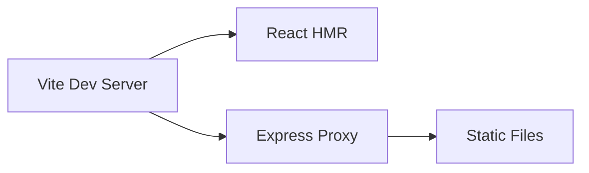
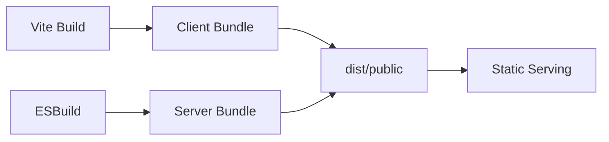

# Architecture Overview

This document provides a high-level overview of Typos_Inc's architecture and design decisions.

## 🏗️ System Architecture

Typos_Inc follows a client-server architecture with clear separation of concerns.

```
┌─────────────────┐     ┌─────────────────┐     ┌─────────────────┐
│   Browser       │     │   Express       │     │   File System   │
│                 │     │   Server        │     │                 │
│  ┌───────────┐  │     │  ┌───────────┐  │     │  ┌───────────┐  │
│  │ React App │  │◄────┤  │ Routes    │  │     │  │ Static    │  │
│  │           │  │     │  │           │  │     │  │ Files     │  │
│  └───────────┘  │     │  └───────────┘  │     │  └───────────┘  │
│                 │     │                 │     │                 │
└─────────────────┘     └─────────────────┘     └─────────────────┘
```

## 🎯 Core Components

### Frontend (React)

#### Key Modules

1. **Pages** (`client/src/pages/`)
   - `Home.tsx` - Main application interface
   - `NotFound.tsx` - 404 error page

2. **Components** (`client/src/components/`)
   - `ui/` - Reusable UI components (buttons, cards, forms)
   - Custom components for specific features

3. **Contexts** (`client/src/contexts/`)
   - `ThemeContext` - Theme management (light/dark mode support)

4. **Hooks** (`client/src/hooks/`)
   - Custom React hooks for shared logic

5. **Lib** (`client/src/lib/`)
   - `humanizer.ts` - Core text humanization logic

### Backend (Express)

#### Server Structure (`server/index.ts`)

- Static file serving for production builds
- Client-side routing support
- Environment-based configuration
- Health checks and logging

## 🔄 Data Flow

1. User inputs text into the textarea
2. Intensity slider sets error density (0-100%)
3. On "Humanize" button click:
   - Input text and intensity are passed to `humanizeText`
   - Text is processed with realistic errors
   - Output is displayed with "VERIFIED HUMAN" stamp
4. User can copy processed text to clipboard

## 🎨 Design System

### Typography Hierarchy

- **Headings**: Courier Prime, Bold, Uppercase
- **Body**: JetBrains Mono, Regular
- **Special**: Special Elite for accent elements

### Color Palette

- **Background**: Manila Folder (`oklch(0.95 0.01 85)`) or Carbon Paper Black
- **Foreground**: Ink Black (`oklch(0.2 0 0)`) or Typewriter White
- **Accent**: Red Pen (`oklch(0.55 0.2 20)`)

### Component Principles

- Brutalist, utilitarian design
- High contrast for readability
- Tactile feedback on interactions
- Paper-like textures and noise

## 🛠️ Build Process

### Development



### Production



## 🔧 Configuration

### Environment Variables

- `NODE_ENV` - Environment mode
- `PORT` - Server port
- `VITE_ANALYTICS_*` - Analytics configuration

### Build Configuration

- **Vite**: Frontend bundling with React plugin
- **ESBuild**: Backend bundling for Node.js
- **TypeScript**: Type checking across client and server
- **Tailwind CSS**: Utility-first styling with custom configuration

## 📦 Dependencies

### Key Libraries

- **@radix-ui**: Accessible component primitives
- **wouter**: Lightweight routing alternative to React Router
- **framer-motion**: Production-ready animations
- **sonner**: Toast notifications
- **react-hook-form**: Form state management
- **zod**: Schema validation

### Development Tools

- **@vitejs/plugin-react**: React support for Vite
- **vite-plugin-manus-runtime**: Custom Manus platform integration
- **prettier**: Code formatting
- **typescript**: Type checking

## 🔐 Security Considerations

- No external API calls for text processing
- Client-side only text transformation
- No user data persistence
- CSP headers for static serving

## 🚀 Performance Optimizations

- Code splitting with Vite
- Lazy loading of components
- Optimized bundle sizes with ESBuild
- Static asset optimization

## 📈 Scalability

Current architecture supports:
- Horizontal scaling via stateless design
- CDN deployment for static assets
- Container-ready with Docker support
- Serverless deployment compatibility

## 🔮 Future Considerations

1. **Backend Processing**: Move text processing to backend for advanced algorithms
2. **User Accounts**: Add authentication and text history
3. **API Integration**: Support for multiple AI text sources
4. **Real-time Collaboration**: Multi-user editing capabilities
5. **Export Options**: Multiple format support (PDF, DOCX)
